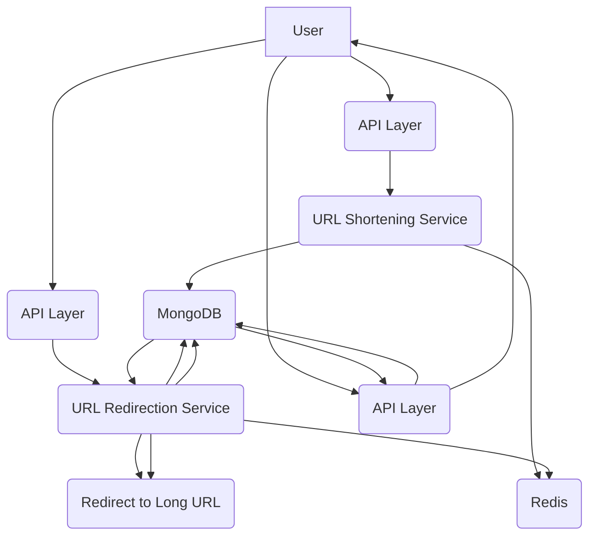

# URL Shortener MVP

This project implements a URL shortening service inspired by System Design School, utilizing Node.js, Express.js, TypeScript, MongoDB, and Redis to provide efficient URL shortening, redirection, and analytics.

## Tech Stack

*   **Backend**: Node.js + Express.js + TypeScript
*   **Database**: MongoDB (Mongoose ORM)
*   **Cache Layer**: Redis (for caching short-to-long URL mappings)
*   **Environment Management**: dotenv
*   **ID Generation**: nanoID (with base62 encoding)

## API Routes

*   `GET /api/v1/health` - Health check route
*   `POST /api/v1/urls/shorten` - Shorten the URL, takes in the long URL
*   `GET /api/v1/urls/:shortenURL` - Redirects to the long URL
*   `GET /api/v1/analytics/:shortenURL` - Provides analytics for the short URL, returning the count of accesses and an array of timestamps.

## System Design Summary (inspired by System Design School)

### Core Functionality:

*   **Shorten long URLs** into unique short codes using nanoID with base62 encoding.
*   **Redirect short URLs** to original links efficiently.
*   **Track access timestamps** for analytics, storing them in an array associated with each short URL.

### High-Level Components:

*   **API Layer**: Express routes handle incoming requests for URL shortening, redirection, and analytics.
*   **Database Layer**: MongoDB persists the mapping between short and long URLs, along with visit history (timestamps).
*   **Caching Layer**: Redis acts as a high-speed cache for frequently accessed short-to-long URL mappings, ensuring quick redirects.

### Scalability:

*   **Redis caching** significantly improves performance for read-heavy operations (redirects), reducing the load on the database.
*   **MongoDB** provides persistent storage and supports the storage of dynamic data like access timestamps for analytics.
*   **nanoID** generates compact and unique short codes, minimizing storage requirements and collision risks.

## High-Level Design

When a long URL is submitted:

1.  nanoID generates a base62 short ID.
2.  The mapping `{ shortURL → longURL }` is saved to MongoDB and cached in Redis.

On every redirect:

1.  Redis is checked first (cache hit → instant redirect).
2.  If cache miss → MongoDB is queried → result cached → user redirected.
3.  Each redirect also appends a new timestamp to `timeStamps[]` in MongoDB.

